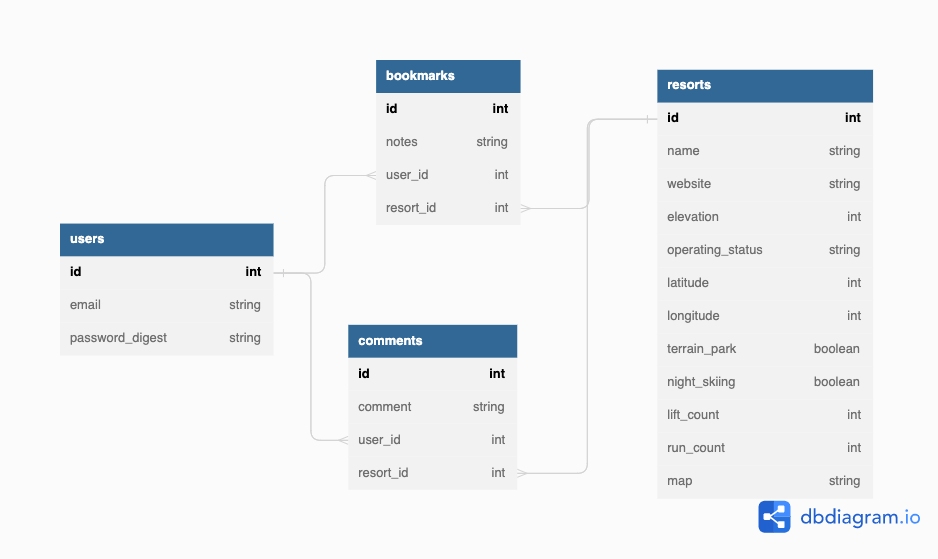

# Ski Colorado

## Description
An application designed to scout ski resorts in Colorado, plan visits, and keep notes on favorite runs and resorts.

## Features
- Homepage display with navigation panel
- Signup with new user account
- Login and logout with secure password 
- Interactive, filterable map display for resorts
- View resort details with comments
- Full CRUD action for user comments 
- Bookmark a resort with private notes 

## Entity Relationship Diagram 


## Tech Stack
* Javascript React
* MUI
* Mapbox 
* Ruby on Rails 

## Requirements 
- Ruby 2.7.4
- NodeJS (v16), and npm
- Postgresql
- [MUI](https://mui.com/material-ui/getting-started/installation/)
    - styled-components, Roboto font, and icons
- [Mapbox](https://www.mapbox.com/)
    - MAPBOX Token 

See Environment Setup below for instructions on installing Ruby and NodeJS.

## Install and Run

install dependencies: 

```
bundle install
rails db:create
npm install --prefix client
```

You can use the following commands to run the application:

- `rails s`: run the backend on [http://localhost:3000](http://localhost:3000)
- `npm start --prefix client`: run the frontend on
  [http://localhost:4000](http://localhost:4000)

## Environment Setup

### Install the Latest Ruby Version

Verify which version of Ruby you're running by entering this in the terminal:

```console
$ ruby -v
```

Version 2.7.4 is recommended. If you need to upgrade you can install it using rvm:

```console
$ rvm install 2.7.4 --default
```

You should also install the latest versions of `bundler` and `rails`:

```console
$ gem install bundler
$ gem install rails
```

### Install NodeJS

Verify you are running a recent version of Node with:

```sh
node -v
```

If your Node version is not 16.x.x, install it and set it as the current and
default version with:

```sh
nvm install 16
nvm use 16
nvm alias default 16
```

You can also update your npm version with:

```sh
npm i -g npm
```

## Acknowledgements 
- Ski resort seed data from [SkiMap](https://skimap.org/pages/Developers)
- Images found on [Unsplash](https://unsplash.com/)
  - Home page image: [Stanley Cheung](https://unsplash.com/photos/PnTlPojUQxY)

  

## License 
[MIT License](https://choosealicense.com/licenses/mit/#)

Copyright (c) [2023] [Jordan Joseph]

Permission is hereby granted, free of charge, to any person obtaining a copy
of this software and associated documentation files (the "Software"), to deal
in the Software without restriction, including without limitation the rights
to use, copy, modify, merge, publish, distribute, sublicense, and/or sell
copies of the Software, and to permit persons to whom the Software is
furnished to do so, subject to the following conditions:

The above copyright notice and this permission notice shall be included in all
copies or substantial portions of the Software.

THE SOFTWARE IS PROVIDED "AS IS", WITHOUT WARRANTY OF ANY KIND, EXPRESS OR
IMPLIED, INCLUDING BUT NOT LIMITED TO THE WARRANTIES OF MERCHANTABILITY,
FITNESS FOR A PARTICULAR PURPOSE AND NONINFRINGEMENT. IN NO EVENT SHALL THE
AUTHORS OR COPYRIGHT HOLDERS BE LIABLE FOR ANY CLAIM, DAMAGES OR OTHER
LIABILITY, WHETHER IN AN ACTION OF CONTRACT, TORT OR OTHERWISE, ARISING FROM,
OUT OF OR IN CONNECTION WITH THE SOFTWARE OR THE USE OR OTHER DEALINGS IN THE
SOFTWARE.
